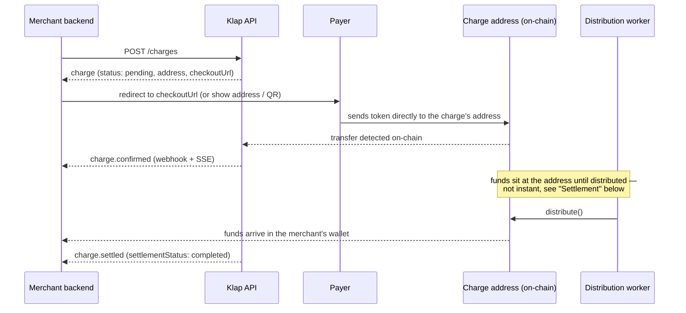

# How it works

Read this before [Getting started](/getting-started) if "predicted,
immutable on-chain address" doesn't already mean something concrete to
you — the rest of the docs assume this model, and it's not the one
Stripe/PayPal-shaped intuition gives you for free.

## The core idea

Klap never holds your money, not even for a second. Every charge
gets its own on-chain address, computed deterministically before the
payer sends anything — the same charge always predicts the same
address, so there's nothing to "generate and store." A payer's transfer
goes straight to that address, not to Klap.

## The address itself

`charge.address` is a [0xSplits](https://splits.org) contract, deployed
(or predicted, if not deployed yet) via `CREATE2` with no `chainId` in
the derivation — which is *why* it's the same address across every
network in `acceptedPayments`: the address doesn't belong to a chain,
it belongs to the charge. A charge accepting `USDC/base` and
`USDT/optimism` has payers on two different chains sending to the exact
same address string.

There's no private key Klap holds for this address, and nothing to
"sweep" — it's a split contract with the merchant's wallet configured
as a recipient at creation time. Klap's role is limited to two
things: **detecting** that a transfer landed (so `charge.status` can
update), and **triggering** the split contract's own `distribute()`
call so the funds actually move out to the recipient (see
"Settlement" below) — `distribute()` itself is permissionless, callable
by anyone, not a privileged Klap-only action.

## Detection: `status`

Klap watches on-chain activity and
updates `charge.status` as transfers arrive — `pending` →
`partially_paid`/`confirmed`, or `expired`/`underpaid` if the deadline
passes first. A transfer is credited once it reaches the network's
required confirmation depth — seconds on most networks, longer on
Ethereum — and the `confirmation_progress` stream event reports how far
along it is in the meantime. See
[Charges](/charges) for the full state machine and
[Real-time status](/realtime) for how to observe it without polling.

**`status: confirmed` means the transfer was seen — it does not mean
the merchant has the money yet.** That's a separate, later step.

## Settlement: `settlementStatus`

Funds sitting at the charge's split address aren't automatically in
your wallet — someone still has to call `distribute()` on that
contract, which is its own on-chain transaction. Klap runs a
background worker that does this for you, after a short grace period
(a few minutes, to batch and avoid triggering a distribution on every
single incoming transfer of a multi-part payment) — not because
there's a queue or a manual step, just because "the transfer landed"
and "the payout transaction executed" are two different blockchain
events with two different timestamps.

This is why `charge.settlementStatus` exists separately from `status`,
and why [Distributions](/distributions) — the list of payouts still
waiting on that worker — is its own resource. If you only care "did the
payer pay," watch `status`. If you specifically need "has the money
actually arrived," watch `settlementStatus` (or use the Node SDK's
`waitForSettlement()`).

## What this rules out

- **No refund API on a normal charge.** Funds go straight from the payer
  to an immutable on-chain split the payer isn't a recipient of, so
  there's no balance to issue a refund from — an over/underpayment is
  surfaced as data (`isOverpaid`, `amountReceived`) for you to handle
  as a business decision, not something the platform can reverse on
  your behalf. See [Charges](/charges).
- **No reversal of a distributed payment.** A transfer that lands
  on-chain is final the moment the network confirms it, and once the
  split has distributed, the money is already with its recipients.
  There's no reservation step to void, and no chargeback path to undo a
  completed distribution.
- **No chargebacks.** There's no card network or bank in this flow to
  initiate one.

The one deliberate exception to "the money moves the moment it's
confirmed" is an [escrow charge](/charges#holding-funds-with-escrow):
its funds accumulate in a Safe dedicated to that charge and distribute
only once a signature from the releaser says so — which also means they
can still be sent back to the payer in full, up until that point. It's
not an authorization-and-capture (the payer's transfer is a real,
final on-chain transfer either way) and it's not a partial refund of
settled money — it's a settlement step you hold the key to, and it is
the only place in Klap where funds pause between arriving and being
distributed.

## See also

- [Getting started](/getting-started) — create your first charge.
- [Charges](/charges) — the full charge lifecycle and `Charge` shape.
- [Distributions](/distributions) — tracking payouts still waiting on
  the distribution worker.
- [Real-time status (SSE)](/realtime) — how `status`/`settlementStatus`
  updates reach you without polling.
